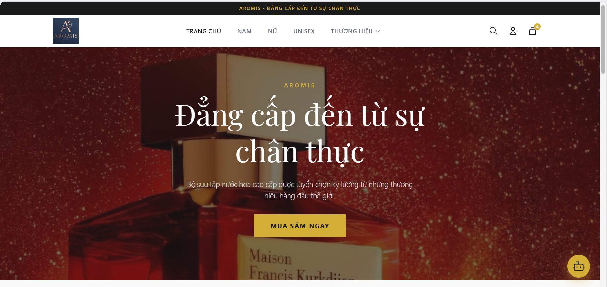
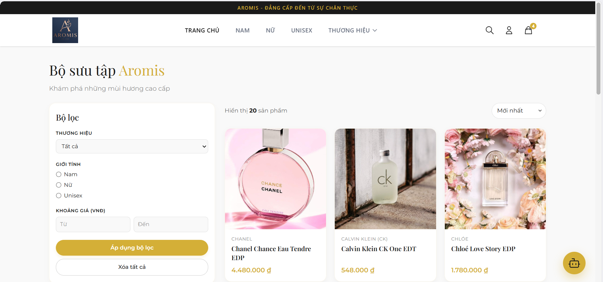
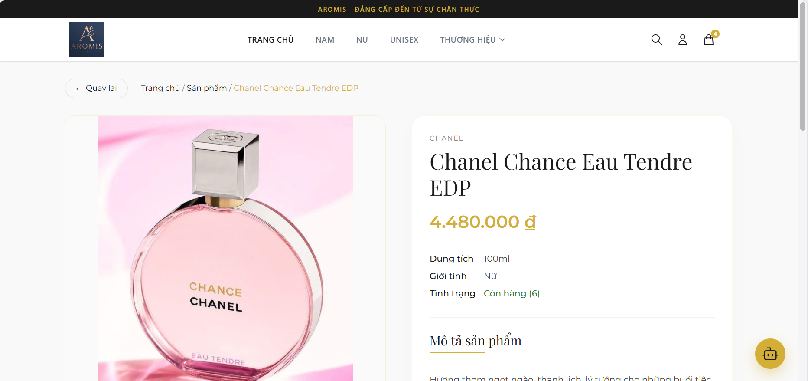
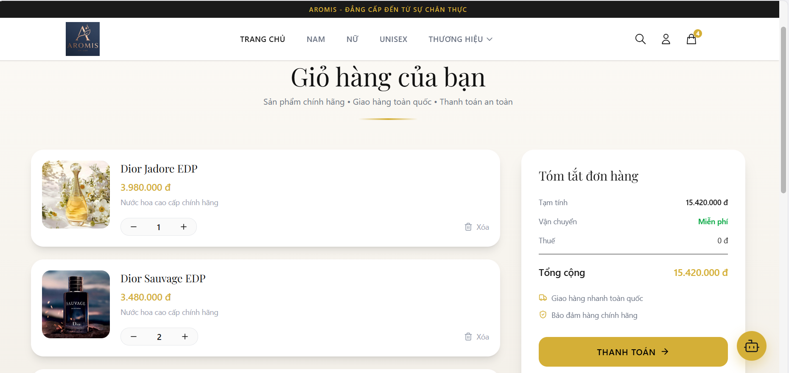

# AROMIS - Website Thương Mại Điện Tử Nước Hoa Cao Cấp
> **Nhóm 08** | **Đồ án môn học Thiết kế Web**

---

## 👥 Danh sách thành viên & Phân công

| Họ và Tên | MSSV | Nhiệm vụ chính |
| :--- | :---: | :--- |
| **Trần Thị Như Hậu** | 24126071 | Làm trang danh sách sản phẩm, chi tiết sản phẩm, thiết kế Figma |
| **Trần Phan Minh Hoài** | 24126077 | Làm trang đăng nhập, đăng ký, liên hệ, lịch sử đơn hàng, thiết kế Figma |
| **Phạm Lê Diệu Hoàng** | 24126078 | Làm trang cẩm nang, lỗi 404, trang chủ, giới thiệu, thiết kế Figma |
| **Trần Thanh Hoàng** | 24126080 | Làm trang giỏ hàng, thanh toán, tìm kiếm, thiết kế Figma |
| **Lê Xuân Hùng** | 24126092 | Quản trị dự án trên GitHub, Deploy sản phẩm lên GitHub Pages, xử lý lỗi kỹ thuật trong quá trình Build, quản lý Figma và tiến độ toàn bộ dự án |

---

## 📖 1. Chủ đề & Thương hiệu
* **Dự án:** Website thương mại điện tử nước hoa cao cấp **Aromis**
* **Phong cách:** Luxury Minimalism (Tối giản sang trọng)
* **Màu sắc chủ đạo:** Vàng Gold (`#D4AF37`), Đen và Trắng.
* **Font chữ:** *Playfair Display* (Tiêu đề) & *Montserrat* (Nội dung).

---

## ✨ 2. Tính năng nổi bật
* **Bộ lọc thông minh:** Lọc sản phẩm theo Thương hiệu, Giới tính và Giá tiền.
* **Giỏ hàng:** Hỗ trợ thêm/xóa/tính tổng tiền thời gian thực.
* **Đa thiết bị:** Responsive hoàn hảo trên Desktop, Tablet và Mobile.
* **Tích hợp Chatbot AI:** Tư vấn sản phẩm cho khách hàng dựa trên nhu cầu cá nhân.
* **Phân quyền:** Chỉ tài khoản đã đăng nhập mới xem được lịch sử đơn hàng.

> **🔐 Tài khoản giả lập (Test Account):**
> * **TK:** `hung@hcmute.edu.vn`
> * **MK:** `123456`

---

## 🔗 Liên kết dự án
* 🎨 **Thiết kế Figma:** [Xem bản thiết kế (View-only)](https://www.figma.com/design/NkYZO7GEiEdEIDWVsua6Xa/Thi%E1%BA%BFt-k%E1%BA%BF-figma-cu%E1%BB%91i-k%E1%BB%B3?node-id=605-300&t=jbdCXMExem1qXHjN-1)
* 🚀 **Website Live:** [Truy cập Aromis trên GitHub Pages](https://hung12340.github.io/nhom08_nuochoa/)

---

## 🛠️ Hướng dẫn chạy Local
Để khởi chạy dự án trên máy tính cá nhân, bạn mở Terminal tại thư mục dự án và chạy lệnh sau:

```bash
npm install && npm run dev

---

## 📸 Ảnh chụp giao diện
<p align="center">
  
  
</p>
<p align="center">
  
  
</p>